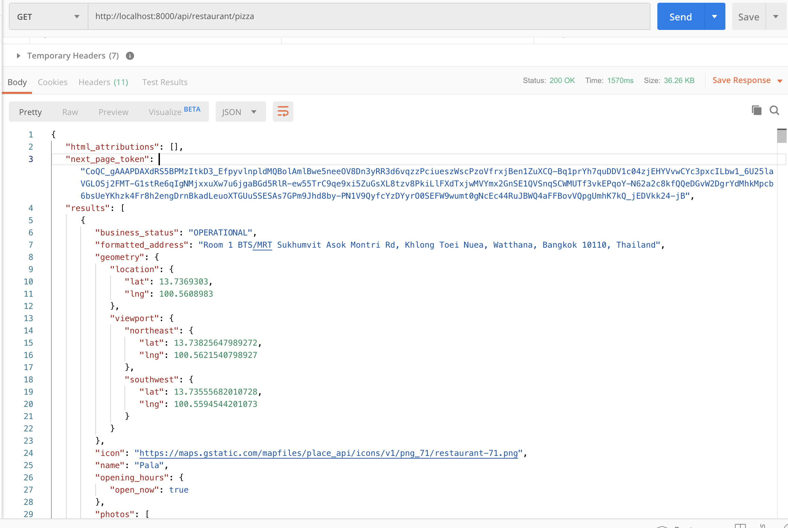
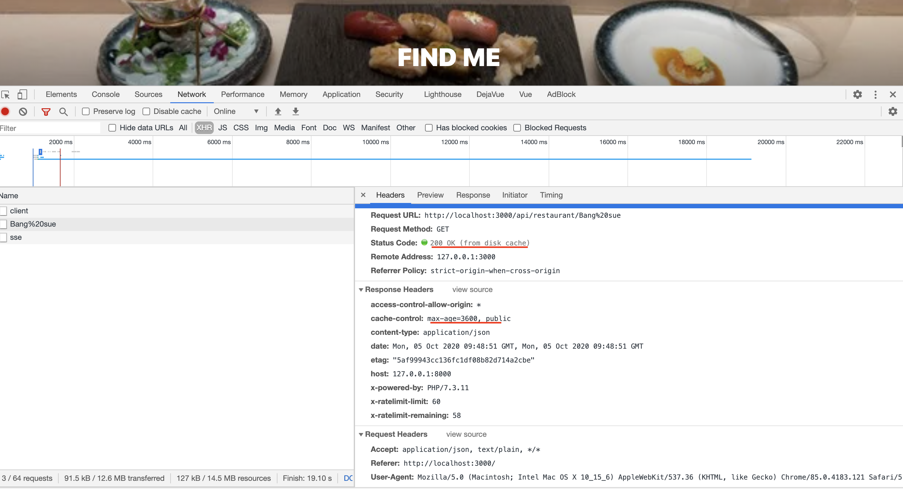

# Restaurant API

## Prerequire

- PHP
- Composer
- [Ecosystem for Laravel](https://laravel.com/docs/8.x/installation#server-requirements)

## Run Project

1. install dependencies

```
composer install
```

2. สร้าง file `.env` ที่ root project โดยให้ทำ api key ของ google place api มาใส่เป็น value (แต่ถ้าไม่มี ขอมาทางผมได้ครับ)

```
GOOGLE_PLACE_API_KEY={GOOGLE_PLACE_API_KEY}
```

3. run dev server

```
php artisan serve
```
default dev server will start at http://127.0.0.1:8000/


## Relate file

- app/Http/Controllers/RestaurantController.php

```php
// ...

{
    public function getByWord(Request $request, $placesText) {
        $nextPageToken=$request->input('nextpagetoken');

        // generate Google Place API
        $url = 'https://maps.googleapis.com/maps/api/place/textsearch/json';

        if (!isset($nextPageToken) || trim($nextPageToken) == '') { // first page
            $url .= '?query=' . $placesText;
            $url .= '&language=th';
            $url .= '$region=.th'; // region must be thai only
            $url .= '&type=restaurant'; // region must be restaurant only
            // $url .= '&inputtype=textquery&fields=photos,formatted_address,name,rating,opening_hours,geometry,types,icon';
            $url .= '&inputtype=textquery&fields=rating,opening_hours';
        } else { // next page
            $url .= '?pagetoken=' . $nextPageToken;
        }

        $url .= '&key=' . env("GOOGLE_PLACE_API_KEY", "");


        $response = Http::get($url);

        // if have error status from extrenal API
        // this API will reject 500 only
        if (!$response->successful()) {
            Log::error($response);
            return abort('500', $response);
        }

        return response($response)
            ->header('Content-Type', 'application/json');
    }
// ...
```

- routes/api.php

```php
Route::middleware('cache.headers:public;max_age=3600;etag')->group(function () {
    Route::get('/restaurant/{placesText}', 'RestaurantController@getByWord');
});
```

## Objective

- use Laravel framework

- use PHP communicate Google Map API

    code in app/Http/Controllers/RestaurantController.php

    ```php

    // generate Google Place API
    $url = 'https://maps.googleapis.com/maps/api/place/textsearch/json';

    if (!isset($nextPageToken) || trim($nextPageToken) == '') { // first page
        $url .= '?query=' . $placesText;
        $url .= '&language=th';
        $url .= '$region=.th'; // region must be thai only
        $url .= '&type=restaurant'; // region must be restaurant only
        // $url .= '&inputtype=textquery&fields=photos,formatted_address,name,rating,opening_hours,geometry,types,icon';
        $url .= '&inputtype=textquery&fields=rating,opening_hours';
    } else { // next page
        $url .= '?pagetoken=' . $nextPageToken;
    }

    $url .= '&key=' . env("GOOGLE_PLACE_API_KEY", "");


    $response = Http::get($url);
    ```

    result capture

    

- Cache result

    code in routes/api.php

    ```php
    Route::middleware('cache.headers:public;max_age=3600;etag')->group(function () {
        // ...
    });
    ```

    result capture

    

- Put some comment in code

- Update code to git server (Github)
